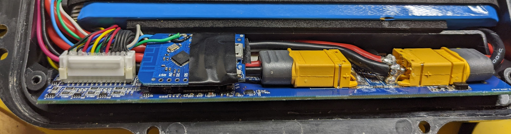

# Owie

This project is unlocks battery expansion possibilities on otherwise
locked Onewheels, adds WiFi-based monitoring of various battery health signals such as individual cell voltages, current, etc.

# Disclaimer

The authors and contributors of this project are in no way affiliated with Future Motion Inc. Onewheel, Onewheel XR, Onewheel Pint, Onewheel Plus, etc are registered trademarks of Future Motion Inc.

This is a hobby projet for its contributors and comes with absolutely no guarantees of any sorts. **Messing with your Onewheel in any way voids its warranty and could potentially lead to property loss, injuries or even death.** Don't be silly and use this project at your own risk.

# Features

- Unlocks battery expansion capabilities on Pints and XRs.
- Displays correct battery percentage in the official Onewheel app.
- Defeats BMS <-> Controller pairing and allows you to use any Pint or XR BMS in your board.
- Shows various stats about your battery on a web page through WiFi - Voltage, current, individual cell voltages and more.
- Supports future firmware updates via WiFi - no need to reopen your board.
- Adds password protection to your board

# Installing Owie into your board

## Prerequisites:

- Have essential soldering skills and tools: Soldering iron, some 22 gauge or otherwise thin wires, fish tape or isolating tape.
- Be comfortable with opening your board's battery enclosure.
  - For the PINT you require a somewhat exotic Torx 5 point security bit, size TS20. [Amazon link](https://www.amazon.com/gp/product/B07TC79LVH)
  - For the XR+ you will need a 3/32" Allen key. [Amazon link](https://www.amazon.com/dp/B0000CBJE1)
- Wemos D1 Mini Lite - the cheapest and most compact ESP8266 board that I'm aware of. You can find those on Aliexpress and Amazon. Buy version without the metal shield or ceramic WiFi antenna on it as they're too bulky to fit inside of the battery enclosure. [5 pack Amazon Link](https://www.amazon.com/dp/B081PX9YFV).

## Flashing Owie for the first time

1. Download the latest [`firmware.bin`](https://github.com/lolwheel/Owie/releases/latest/download/firmware.bin).
2. Follow the instruction on the ESP WebTools page [here](https://ow-breaker.github.io/). Note that firmware flashed through this website might be older than the latest official release. To make sure that you're running the latest version, follow the instructions in the "Updating Owie" section below after the initial flash.
3. Verify the flash success: When the chip is on, you should see
   a WiFi network called `Owie-XXXX`. Connecting to it should send you
   straight to the status page of the Owie board. Don't worry about the data because the board isn't hooked up yet.

## Installation into the board:

NEW: Follow this step-by-step installation video made by one of the community members - https://www.youtube.com/watch?v=HhKdwnYUbA0

Or follow these instructions below:

1. Install Owie fimrware onto your Wemos D1 mini as instructed above.
2. NEW: I highly recommend physically removing the reset button from the chip with pliers to exclude possibility of it accidentally getting pressed while inside of your Onewheel.
3. Disassemble your board and open the battery enclosure.
4. Disconnect all wires from BMS, strictly in the following order:
   1. Battery balance lead - the leftmost connector (24 wires) on the BMS.
   2. Battery main lead - an XT60 connector on the rightmost side of the BMS.
   3. All the other wires to the BMS, the order here doesn't matter.
5. Prepare your Wemos D1 Mini and BMS:
   1. Tin 4 consecutive pins on Wemos D1 Mini marked as **TX, RX, D1, D2** as well as **5v, GND** pins.
   2. Solder a small wire **on the top of the board** connecting the pin marked as **TX** to the pin marked as **D2**
   3. Solder power pickup wires to the BMS. The JWFFM chip installation video demonstrates this well - [Youtube: Power pickup from BMS](https://youtu.be/kSWicH8hUFo?t=1028)
   4. Cut the **WHITE** and **GREEN** wires from the three-wire connector around 3/4 of an inch from the connector. Wrap the Green wire **leading to the BMS**(the 3/4 inch stub) in an isolating wire as we won't be needing it. Tin the other three wire endings, you'll be soldering those to the Wemos D1 Mini.
      Again, JWFFM install video has a good demonstration of this: [Youtube: Cutting GREEN and WHITE wires](https://youtu.be/kSWicH8hUFo?t=453)
6. Connecting wires to your Wemos D1 Mini. I found it much easier to solder these to the bottom of the board:
   1. Connect the **GROUND** wire from the **BMS**, the middle wire out of the BMS 5 pin connector to **GND** on Wemos D1.
   2. Connect the **5v** wire, the other one from BMS to the **5v** on the board.
   3. Connect the **WHITE** wire **RUNNING TO THE MAIN BOARD** to the **TX** pin on the board.
   4. Connect the **GREEN** wire **RUNNING TO THE MAIN BOARD** to the **D1** pin on the board.
   5. Connect the **WHITE** stubby wire running to the **BMS** to the **RX** pin on the board.
   6. Cover the bottom of the Wemos D1 mini with either fish tape or isolating tape so that non of the exposed soldering joints have any chance of contacting anything on the BMS. I also put a bunch of tape on the top of the board, just in case.

DONE!

## Troubleshooting:

### Board reporting battery at 1% after install

If after installing OWIE into your board it reports that your battery is at 1% even though it shouldn't, plug your board into a charger.
This problem occurs because the BMS goes through a state reset and doesn't know the status of the battery, and plugging the board
into a charger corrects this issue by forcing the BMS (and controller potentially) to do a state check.

Pictures demonstrating soldering points on the board:

How it looks like in my setup:

# Board Locking functionality

TL;DR: You can immobilize your board by quickly power cycling the board. Once immobilized, you unlock the board by logging into Owie WiFi, tapping a button and power cycling the board. Keep reading for details.

**WARNING:** Arming your board for parking **will** disable the emergency recovery mode (2 restarts), so if you forget your network password, the only way to recover is to reflash via USB.
The normal OTA update mode will still be functional as normal (see below for OTA instructions).
Disarming the board will restore the emergency recovery mode.

Use these instructions if you want to be able to 'park' your onewheel using the power button sequence.
The park functionality comes by interrupting all communication between the BMS and the controller, thus causing an error 16.
This functionality can be removed quite easily by someone motivated enough and with enough knowledge; all that's required is to open up the board, remove Owie and solder the wires back together, or to reflash it via USB.

## Setup

1. Set an Owie network password in `Settings`.
1. Tap the `Arm` button in `Settings`. This arms your board so you can put it into 'park'.

## Parking your board

When you need to park your board, turn it on and then off in less than 5 seconds.

## Un-parking your board

Use these instructions to un-park your board so you can go ride.

1. Power on your board normally. Ignore the error 16 (that's how the board gets parked).
1. Connect to your password protected Owie network.
1. On the status screen, click the `Unlock` button.
1. Then as the button will remind you, restart your board to get rid of the error 16.

# Updating Owie

Use these instructions to update your Owie installation over WiFi (OTA).

## Using OTA

These instructions will work so long as you can connect to your regular `Owie-XXXX` network.

1. Download the latest `firmware.bin` from the Releases tab.
1. Once you have your hands on a firmware.bin file, copy that binary onto your flashing device of choice (desktop, laptop, phone). Some phones might not let you select the binary, thus you will need to use a computer.
1. Bring that device close to your board, and ensure that your Onewheel has at least a few percent of battery left in the tank.
1. Connect to your normal Owie network `Owie-XXXX`, and navigate to your normal owie IP (192.168.4.1).
1. You should see the Owie menu load as normal.
1. Click "Settings" button, hit the "Browse" button in the Firmware section of the page and select the `firmware.bin`.
1. The page will look unresponsive during the file upload, do not refresh it.
1. Once the file is uploaded you will see a success message. DO NOT CUT POWER TO OWIE until it's WiFi is back on. Doing otherwise will brick your Owie and you'll have to re-flash it via USB.
1. Connect to the normal owie network, and check that your update has worked.
1. Enjoy.

## Recovering an Owie flash

These instructions are for if you somehow manage to bungle flashing your wemos OTA.
They are the last step you can reasonably take before having to remove the chip from your board and flash it using a USB cable.

1. Follow the instructions above for how to build Owie from source using gitpod (or grab a release binary if they're available).
1. Once you have your hands on a firmware.bin file, copy that binary onto your flashing device of choice (desktop, laptop, phone). Some phones might not let you select the binary, thus you will need to use a computer.
1. Bring that device close to your board, and ensure that your Onewheel has at least a few percent of battery left in the tank (don't have it plugged in though).
1. Power cycle the Onewheel 2 times (reboot it) in less than 3 seconds. Keeping your app connected can be useful here as once Owie makes it into recovery mode, your board will report an error 16 (don't worry, this is supposed to happen).
   1. On XR's your headlights will come on as normal, but after a few seconds they will dim and then totally turn off, followed by your power button light flashing rapidly to indicate that error 16.
1. Connect to the wifi network named _Owie-Recovery_, and navigate to your normal owie IP (192.168.4.1).
1. You should see the firmware upload dialog. Point the file selector to the `firmware.bin` and wait for it to upload.
1. Either check for your normal Owie wifi network to come back online, or in the app you should see battery percentage being reported again. Once either of these things occur (preferrably both), you can restart your board to reset the error 16.
1. Connect to the normal owie network, and check that your update has stuck.
1. Enjoy.

# [For posteritys sake] Things I've found during the development:

The BMS (Battery Management System) board, located in the battery side of the onewheel, communicates with the main board via [RS485](https://en.wikipedia.org/wiki/RS-485) protocol. Details that I've managed to discover so far:

- The communication is unidirectional. The data flows only from BMS to MB. It's 115200 baud, standard 8N1 framing.
- The RS485 bus signaling voltage seems to be 3.3v. This makes it possible to read the bus voltages directly via ESP8266 and doesn't require 5v -> 3.3v level shifting.
- Both ends of the RS485 bus are terminated properly - 120 ohm resistors across the A and B lines and pullup / pulldown resistors A and B lines correspondingly.

## Doing away with MAX485 drivers

Technically, we'd need to use RS485 drivers such as MAX485 to intercept and retransmit bits on the line, however so far it seems like we can do away with them:

### Receiving RS485 directly via hardware UART:

The A (high) line of the RS485 bus coming from the BMS can be read directly via hardware UART with a little care.

When the line isn't driven by the BMS transmitter, it hovers around 3.3v/2 = 1.6v due to the terminating resistors on the BMS side. 1.6v isn't a defined logic level for a GPIO pin so chances are we'll read spurious data. However, if we turn on the pullup resistor of the UART RX pin to which the A line is connected, the bus idle voltage gets pulled up to right above 3 volts, which is more than 0.75\*VDD necessary for a logic 1 input, mentioned in ESP32 datasheet. This way the A wire from the BMS can be fed directly into the UART Rx pin and its logical state will read 1 at line idle, just as we want for UART communication.

## Transmitting RS485 without the driver

Transmitting the data to the MB requires us to signal on two wires. The A wire of the RS485 can be connected directly to the output of a hardware UART. The B line must be inverse of the A line as RS485 uses differential signalling.
I've achieved this by simply attaching a pin change interrupt to the UART TX pin and bitbanging the inverse value of this pin to the B line of the RS485.

# Communication protocol

The data frames sent by BMS are of the following general format:

1. Preamble - 3 bytes, fixed: `FF 55 AA`
1. Message type - 1 byte. I've so far observed all values between `0` and `0xD`, inclusive, except `1` and `0x10`
1. Message body - variable length but fixed based on the message type above.
1. Checksum - last two bytes of the frame - simply sum of all of the bytes in the frame, including the preamble.

## Message types:

I've isolated all message parsing code in `src/lib/bms/packet_parses.cpp`, the code should be self-explanatory.
